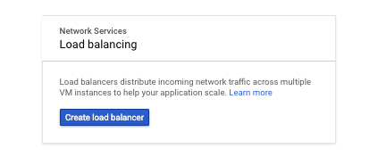
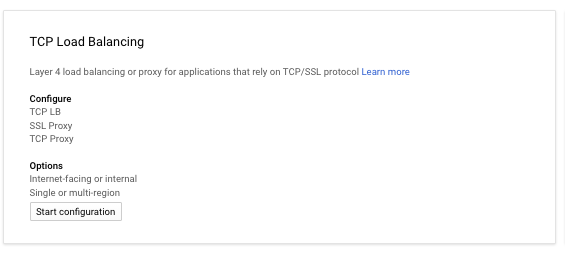
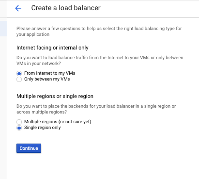
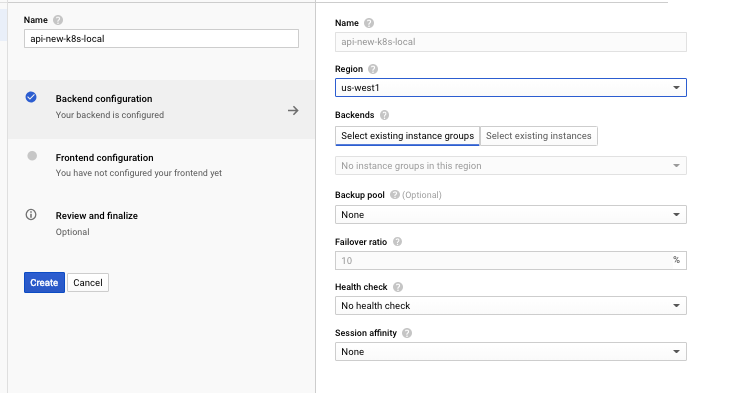
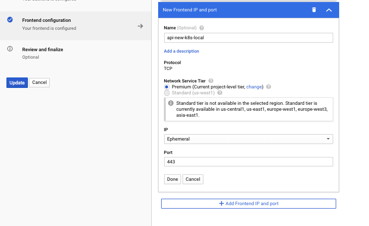
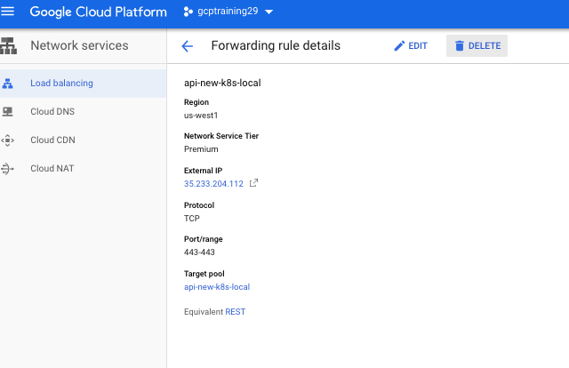
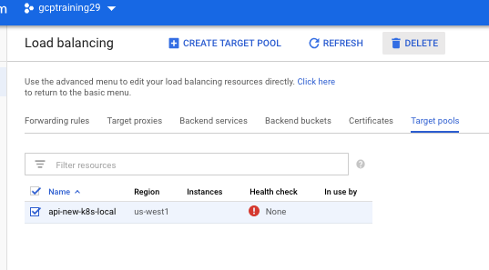

## Manage infrastructure using terraform

### Exercise 1: Manually deploy new cluster using terraform

1. Run the following command to create a new kubernetes cluster and export its terraform state.

    If we do not create LB with forwarding rule of same name we end up getting this error:

    ```
    I0130 13:31:49.429969     541 update_cluster.go:290] Exporting kubecfg for cluster
    error getting ingress status: error getting ForwardingRule "api-new-k8s-local": googleapi: Error 404: The resource 'projects/gcptraining29-217367/regions/us-west1/forwardingRules/api-new-k8s-local' was not found, notFound
    ```

    Before running below we will need to create a LB with name `api-new-k8s-local` along with its forwarding rule called `api-new-k8s-local`:

    
    
    
    
    
    

    Create and then run below after a minute to give time for resource to create.

    ```
    mkdir terraform
    cd terraform
    export KOPS_FEATURE_FLAGS=AlphaAllowGCE
    kops create cluster \
      --name=new.k8s.local \
      --zones us-west1-c \
      --project=${DEVSHELL_PROJECT_ID} \
      --out=. \
      --target=terraform
    ```

1. Change the default network name. This step is required because we are deploying the second cluster inside the same project.

    In the `kubernetes.tf` find the following element
    ```
    resource "google_compute_network" "default" {
      name                    = "default"
      auto_create_subnetworks = true
    }
    ```
    Change network name to `new-default`. The element should look like this:
    ```
    resource "google_compute_network" "default" {
      name                    = "new-default"
      auto_create_subnetworks = true
    }
    ```

    Make sure that you update the etcd disk as well, there is a bug that did not add the labels and will prevent start up. Either remove current disk definition or add labels to definition.
    ```
    resource "google_compute_disk" "c-etcd-events-new-k8s-local" {
      name = "c-etcd-events-new-k8s-local"
      type = "pd-ssd"
      size = 20
      zone = "us-west1-c"
      labels {
        k8s-io-cluster-name = "new-k8s-local"
        k8s-io-etcd-main = "c-2fc"
        k8s-io-role-master = "master"
      }
    }
    resource "google_compute_disk" "c-etcd-main-new-k8s-local" {
      name = "c-etcd-main-new-k8s-local"
      type = "pd-ssd"
      size = 20
      zone = "us-west1-c"
      labels {
        k8s-io-cluster-name = "new-k8s-local"
        k8s-io-etcd-main = "c-2fc"
        k8s-io-role-master = "master"
      }
    }

    ````  

1. Install terraform.
    ```
    wget https://releases.hashicorp.com/terraform/0.11.7/terraform_0.11.7_linux_amd64.zip
    unzip terraform_*
    mv terraform ~/bin/
    rm terraform_*.zip
    ```

1. Execute the following command to see what GCE infrastructure is going to be created.
    ```
    terraform init
    terraform plan
    ```

1. Deploy the new cluster.

    We will now need to delete the LB because it will confuse terraform :|

    

    If you happen to get another failure delete the target pool from LB advanced mode or from forwarding rules:

    


    ```
    terraform apply
    ```

1. Export the cluster credentials
    ```
    kops export kubecfg new.k8s.local
    ```

1. Check whether the cluster is healthy
    ```
    kubectl cluster-info --insecure-skip-tls-verify
    kubectl get nodes --insecure-skip-tls-verify
    ```

### Exercise 2 (Optional): Advanced cluster troubleshooting

At this point, we don't want to explain the cause of the issue, but instead want you to troubleshoot it on your own.

A few clues for you:

1. Check Network services -> Load balancing page to make sure the API load balancer is set up correctly and redirects traffic to the kubernetes master node.  Either from this page or from terraform file try to figure out to what port at the master node load balancer redirects traffic.
1. If the load balancer is set up correctly, SSH to the master node and use `netstat -tulpn` to see whether something is listening on the port you've just discovered.  If not, this means something is probably wrong with the kubernetes API server.
1. All kubernetes master components except kubelet run inside docker.  Use the `docker ps` command to list them.  What do you see?  What components are missing or unhealthy?
1. If the problem is related to kubelet, you may want to look at kubelet logs.  Kubelet runs as a `systemd` service.  Use `sudo journalctl -u kubelet` to list all kubelet logs.
1. Kubelet is responsible for starting all other components.  They are defined as pods.  If some of the components are missing or misconfigured you may want to take a look at the `/etc/kubernetes/manifests` folder to see the definition of all components.  Is there anything suspicious there?
1. If some of the components are unhealthy you can take a look at their logs. They can be found in the `/var/log` folder.
1. There are two important systemd services that are not part of kubernetes, but are deployed by kops.  These services are called `kops-configuration` and `protokube`.  They are responsible for configuring kubelet, starting it, and updating its configuration when you update or upgrade the cluster.  Use `journalctl` to examine their logs.
1. Good luck!  If you are not be able to troubleshoot the issue, we'll show you the solution a little bit later.
